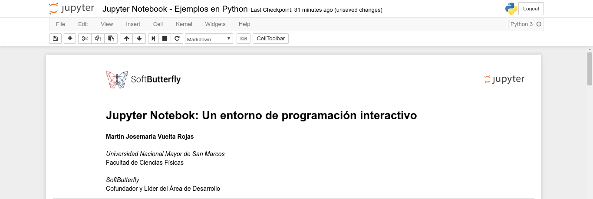

# Jupyter Notebook: Un entorno interactivo de programación

[][1]
[![BSD-3-Clause][2]][1] [![Python][3]][1] [![HTML5][4]][1] [![MD][5]][1] [![Jupyter Notebook][6]][1] [![Spark][7]][1] [![Flisol 2017][8]][1]

*Notebooks* de ejemplos que usé durante la presentación de Jupyter Notebook en el Festival de Instalación de Software Libre 2017 en la Universidad Privada del Norte, Lima, Perú.

## Donde ver los *notebooks*?

Míralos en

* **Github**: [Parte I](https://goo.gl/Da35OO) y [Parte II](https://goo.gl/XbmpwQ)
* **nbviewer**: [Parte I](https://goo.gl/dvXPmk) y [Parte II](https://goo.gl/wgAkhB)

## How to use

1. Clona el repositorio
    ```
    git clone /https://github.com/softbutterfly/softbutterfly-wagtail-materialize.git
    ```

2. Inicia el servidor de Jupyter Notebook y listo
    ```
    jupyter notebook
    ```

    Para ejecutar el notebook de la segunda parte necesitas ademas tener instalado Spark y ejecutar el servidor como
    ```
    PYSPARK_DRIVER_PYTHON=jupyter PYSPARK_DRIVER_PYTHON_OPTS="notebook --ip=127.0.0.1 --port=8888" pyspark --master local --executor-memory 1024M --driver-memory 1024M
    ```

3. Espera hasta que el navegador web se abra, navega por el repositorio y disfruta :smile:

## Autor

* [@zodiacfireworks](https://github.com/zodiacfireworks)

## Licencia

Todos los recursos creados por mi en este repositorio son liberados bajo la licencia BSD-3-Clause. Revise el archivo `LICENSE.txt` de este repositorio.

Los recursos de este repositorio con su propia licencia son protegidos por ellas.

Si encuentras contenido protegido por derechos de autor en este repositorio, por favor, házmelo saber para otorgar los créditos respectivos de acuerdo a ley.

[1]: git@github.com:zodiacfireworks/meteorological-faker.git
[2]: https://img.shields.io/badge/License-BSD%203%20Clause-blue.svg?maxAge=2592000&style=flat-square
[3]: https://img.shields.io/badge/Language-Python-green.svg?maxAge=2592000&style=flat-square
[4]: https://img.shields.io/badge/Language-HTML5-orange.svg?maxAge=2592000&style=flat-square
[5]: https://img.shields.io/badge/Language-Markdown-lightgrey.svg?maxAge=2592000&style=flat-square
[6]: https://img.shields.io/badge/Tool-Jupyter%20Notebook-orange.svg?maxAge=2592000&style=flat-square
[7]: https://img.shields.io/badge/Tool-Spark-orange.svg?maxAge=2592000&style=flat-square
[8]: https://img.shields.io/badge/Topic-Flisol%202017-blue.svg?maxAge=2592000&style=flat-square
